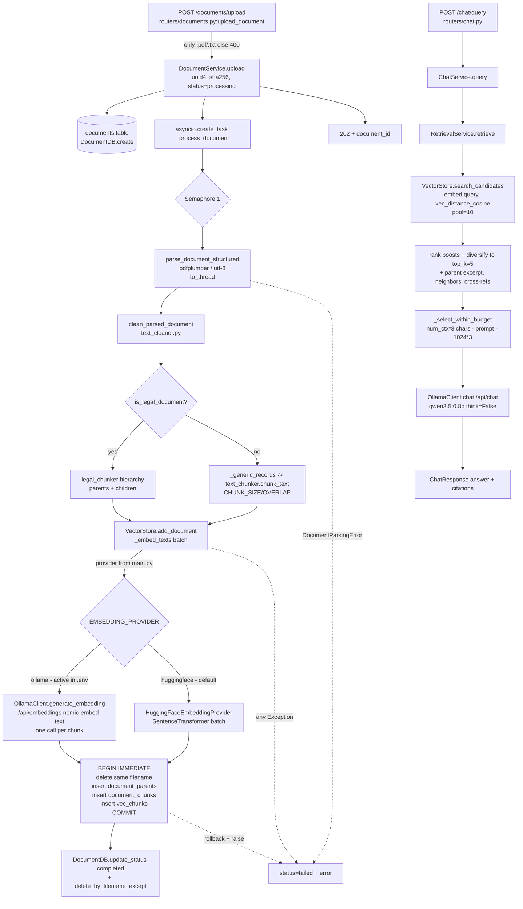

# Scatterbrain: document processing flow (read-only trace)

## Summary

- Upload returns 202 immediately. Ingestion runs in a background asyncio task, one document at a time (`Semaphore(1)`).
- Pipeline: hash bytes -> parse (pdfplumber / UTF-8) -> clean -> legal-vs-generic routing -> parent/child chunks -> batch embed -> one atomic SQLite transaction (parents, children, vectors) -> mark `completed`.
- Active embedding provider: the repo default is `huggingface` (`litillabs/litil-embed-0.6b`), but `.env` sets `EMBEDDING_PROVIDER=ollama` with `OLLAMA_EMBEDDING_MODEL=nomic-embed-text`. The `.env` value wins, so the live backend uses Ollama `nomic-embed-text` (768 dims). The HuggingFace path is wired but inactive.
- Chat LLM: Ollama `qwen3.5:0.8b` via `/api/chat`, `think=False`, `num_ctx=8192`.
- `.env` sets `SQLITE_DB_PATH=backend\scatterbrain.db`, a relative path. It resolves against the process cwd, not the repo root (unlike `.env` itself, which is resolved absolutely). Starting uvicorn from `backend/` would use `backend\backend\scatterbrain.db` (a different, new DB).
- Likely causes for the original symptom (`GET /documents/<id>` returns nothing / 404):
  1. The server points at a different DB file than the one that holds the id (the cwd issue above).
  2. The id was superseded. After a successful re-upload of the same filename, `DocumentDB.delete_by_filename_except` deletes older metadata rows, so old ids 404 by design.
  3. The id was deleted, or the row never existed (a random UUID is generated per upload).
  I could not confirm which applies. I did not query the DB or call the server (read-only).

## Flow diagram



```mermaid
sequenceDiagram
    participant U as Client
    participant R as documents router
    participant DS as DocumentService
    participant DB as DocumentDB (documents)
    participant PR as parser/cleaner/chunker
    participant VS as VectorStore
    participant EM as Embedding provider
    U->>R: POST /documents/upload (file)
    R->>DS: upload(filename, bytes)
    DS->>DB: create(status=processing)
    DS-->>R: record (task scheduled)
    R-->>U: 202 {document_id}
    DS->>PR: parse -> clean -> chunk (threads)
    DS->>VS: add_document(records)
    VS->>EM: embed children (before txn)
    EM-->>VS: vectors
    VS->>VS: BEGIN; delete by filename; insert parents, chunks, vec_chunks; COMMIT
    DS->>DB: update_status(completed, chunk_count, ...)
    DS->>DB: delete_by_filename_except(filename, id)
    U->>R: GET /documents/{id} (poll)
    R->>DS: get_document
    DS->>DB: SELECT by id
    U->>R: POST /chat/query
    R->>DS: (ChatService) query
    Note over R,VS: embed query (with HF query prefix if HF) -> vec search -> rank -> prompt -> Ollama /api/chat
```

## Evidence by stage

### 1. Upload: `backend\routers\documents.py:upload_document`
- Input: multipart `file`. Rejects names not ending `.pdf`/`.txt` with 400. Reads whole file into memory, calls `DocumentService.upload`. Output: 202 `UploadResponse(document_id)`.
- Errors: 400 for type only. No size limit.

### 2. Orchestration: `backend\services\document_service.py`
- `upload`: `uuid4` id, sha256 of bytes, `DocumentDB.create` (status `processing`), `asyncio.create_task(_process_document)`.
- `_process_document`: under `Semaphore(1)` runs `parse_document_structured`, `clean_parsed_document`, `chunk_parsed_document` via `asyncio.to_thread`. Raises if no child chunks. Then `VectorStore.add_document`, `update_status("completed", chunk_count, title, version, extraction_method, parser_version, schema_version, needs_reingestion=False)`, then `delete_by_filename_except`.
- Errors: `DocumentParsingError` -> `failed` with "Document parsing failed: ..."; any other exception -> logged, `failed` with `str(exc)`.
- Startup: `main.py` calls `DocumentDB.fail_stale_processing()` so interrupted jobs become `failed`.
- Note: the task is fire-and-forget (no reference kept), so it may be garbage collected in rare cases; low risk.

### 3. Parse: `backend\services\document_parser.py:parse_document_structured`
- `.txt` -> UTF-8 single block, `ParsedDocument`. `.pdf` -> `pdfplumber` per page via `_extract_page_structured` (prose and table blocks, furniture removal, printed page/revision detection, title/version detection). Failures wrap into `DocumentParsingError`.
- Mismatch: `_MANUAL_TITLE` hard-codes the "Currency and Exchanges Manual for Authorised Dealers". Legal detection is tuned to that manual.

### 4. Clean and chunk
- `text_cleaner.clean_parsed_document`: normalises each block, preserves raw text.
- `legal_chunker.chunk_parsed_document`: `is_legal_document` scores the text. If legal (score >= 4) builds a hierarchy of parents and children using `LEGAL_CHUNK_TARGET_CHARS=900`, `MIN=450`, `HARD_MAX=1400`, `FORCED_SPLIT_OVERLAP=120`, `PARENT_MAX=8000`. Otherwise `_generic_records` -> `text_chunker.chunk_text` using `CHUNK_SIZE=1000`, `CHUNK_OVERLAP=200` (LangChain `RecursiveCharacterTextSplitter`; Markdown tables packed by row with repeated header).
- `embedding_text` for legal children is `Legal location: <breadcrumb>\nSource text:\n<text>`; this is what gets embedded.
- Config validation lives in `Settings.validate_related_limits`.
- Mismatch: the tech steering doc says `pdfplumber` + a simple chunker; the code is now a legal parent/child pipeline. `text_chunker.py` has `_recursive_split`, a "compatibility wrapper" that appears unused (not verified exhaustively).

### 5. Embedding: `main.py` + `services\embedding_provider.py`
- `main.py` builds `OllamaClient` always (also the chat LLM), then `create_embedding_provider(settings, ollama_client)`.
- `ollama` -> the `OllamaClient` itself (`/api/embeddings`, model `OLLAMA_EMBEDDING_MODEL`, dimension `EMBEDDING_DIMENSION=768`). It has no `generate_embeddings`, so `VectorStore._embed_texts` falls back to one request per chunk (sequential, slow).
- `huggingface`/`hf` -> `HuggingFaceEmbeddingProvider` (SentenceTransformer, batch of `HUGGINGFACE_EMBEDDING_BATCH_SIZE=32`, normalised, query prefix only on queries, dimension read from the model).
- Config: `EMBEDDING_PROVIDER` default `huggingface`; `.env` overrides to `ollama`. Unknown value -> `ValueError`.
- Concern: for Ollama the dimension is declared (768) and not read from the model; `_validate_embedding` checks each vector and fails ingestion on mismatch.

### 6. Storage: `backend\services\vector_store.py` and `document_db.py`
- `initialize`: opens `aiosqlite` on `settings.sqlite_db_path`, loads sqlite-vec, creates/migrates tables:
  - `document_chunks` (children: chunk_id unique, document_id, filename, chunk_index, content, plus ~30 metadata columns incl. parent_id, clause_path, embedding_text, source_text).
  - `document_parents` (parent_id PK, same style metadata, source_text).
  - `embedding_metadata` (single row: provider, model, dimension).
  - `vec_chunks` virtual table `vec0(chunk_id TEXT PRIMARY KEY, embedding FLOAT[dim])`.
  - Indexes on document_id, parent_id, clause_path.
- Guard: `_validate_embedding_configuration` raises at startup if provider/model/dimension differ from `embedding_metadata`. So switching ollama <-> huggingface on the same DB fails startup by design (this likely explains why a separate `scatterbrain_huggingface.db` exists).
- `add_document`: embeds first, then `BEGIN IMMEDIATE`, deletes all existing rows for the same **filename**, inserts parents, children, and packed float32 vectors, commits. Rolls back on error (old data kept).
- `DocumentDB` (`documents` table, sync `sqlite3`, same file): columns document_id PK, filename, uploaded_at, status, error, chunk_count, source_sha256, document_title, document_version, extraction_method, parser_version, schema_version, needs_reingestion. Status: `processing` -> `completed` | `failed`.
- Concerns:
  - `document_chunks.document_id` is NOT NULL but has no FK; replacement is keyed by filename, not id. Re-uploading a file replaces the old vectors and (after success) removes the old metadata row, so the old document_id stops resolving.
  - Two SQLite connections (aiosqlite + sqlite3) on one file; sync `DocumentDB` calls run on the event loop and can briefly block.
  - Relative `SQLITE_DB_PATH` depends on cwd (see summary). Both `VectorStore` and `DocumentDB` use the same setting, so they stay consistent with each other but not across launch dirs.

### 7. Query: `routers\chat.py` -> `chat_service.py` -> `retrieval_service.py`
- `POST /chat/query` (`ChatRequest.query`, `history`) calls `ChatService.query(top_k=RETRIEVAL_TOP_K=5)`. The history is echoed back but **not sent to the LLM** (only system + one user message).
- `RetrievalService.retrieve`: candidate pool `RETRIEVAL_CANDIDATE_POOL=10` via `VectorStore.search_candidates` (query embedded with `generate_query_embedding` if present, else `generate_embedding`; SQL `vec_distance_cosine` join of `document_chunks` and `vec_chunks`, similarity = 1 - distance). Then regex boosts (clause match +1.0, amount/BoP code +0.35, defined term/acronym +0.20), exact clause lookups, diversification (`MAX_CHILDREN_PER_PARENT=2`, `PER_SECTION=3`), parent excerpt (600 chars), continuation/adjacent neighbours, cross-reference targets.
- `ChatService._select_within_budget`: budget = `num_ctx*3` chars minus prompt minus 3072 answer reserve; drops lowest-ranked blocks that do not fit.
- LLM: `OllamaClient.chat` -> `/api/chat` with `model=OLLAMA_MODEL`, `think=OLLAMA_THINK (False)`, `options.num_ctx`, `num_gpu`. Reply `message.content`.
- Errors: `OllamaClientError` -> 503; others -> 500. Response: answer, history, `retrieved_chunks`, citations.
- Also present: `routers\search.py` (raw retrieval endpoint), not covered in the original steering docs.
- Concern: `retrieved_chunks` counts `result.source_texts`; it includes expansion contexts (adjacent/cross-ref), so it can exceed top_k.

## Config keys quick reference
| Key | Default | Effective (.env) |
|---|---|---|
| EMBEDDING_PROVIDER | huggingface | **ollama** |
| OLLAMA_EMBEDDING_MODEL | nomic-embed-text | nomic-embed-text |
| HUGGINGFACE_EMBEDDING_MODEL | litillabs/litil-embed-0.6b | same (unused) |
| EMBEDDING_DIMENSION | 768 | default |
| OLLAMA_MODEL | qwen3.5:0.8b | qwen3.5:0.8b |
| SQLITE_DB_PATH | scatterbrain.db | backend\scatterbrain.db (relative to cwd) |
| CHUNK_SIZE / OVERLAP | 1000 / 200 | default (generic docs only) |
| RETRIEVAL_TOP_K / POOL | 5 / 10 | default |

Only the `.env` lines I grepped are reflected here; other keys may be set there too.

## Conclusions and recommendations (nothing implemented)
1. Diagnose the 404: run `GET /documents/` (trailing slash) and compare the ids with the one you searched; check which DB file the running server opened (startup log line "VectorStore initialized for <path>"). Then query the `documents` table in that file for the id.
2. Make `SQLITE_DB_PATH` absolute or resolve it against the repo root in `config.py` (as `_ENV_FILE` already is) so launch directory does not change the DB.
3. Decide on the id-supersede behaviour: re-upload of the same filename deletes the older document id. Consider returning the existing id or documenting it in the UI.
4. Add a batched `generate_embeddings` to `OllamaClient` (Ollama `/api/embed` accepts a list) to speed ingestion on the active provider.
5. Pass chat `history` to the LLM, or drop it from the API contract.
6. Update steering docs (`tech.md`, `structure.md`): the HuggingFace provider, legal chunker, retrieval service, search router and `embedding_metadata` guard are not described.
7. Remove or confirm unused code (`text_chunker._recursive_split`, legacy `parse_document`).
