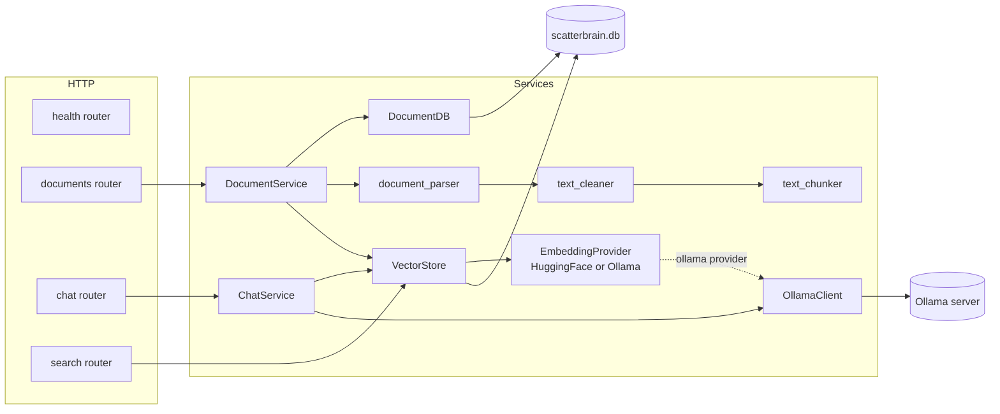

# Scatterbrain Backend Documentation

The backend is a FastAPI app that ingests PDF/TXT documents into a SQLite + sqlite-vec vector store and answers questions over them with a local Ollama LLM.

## Sections

| Doc | Covers |
| --- | --- |
| [app-and-config.md](app-and-config.md) | `main.py` (startup wiring) and `config.py` (settings) |
| [models.md](models.md) | Pydantic request/response models (`models/`) |
| [routers.md](routers.md) | HTTP endpoints (`routers/`) |
| [services.md](services.md) | Business logic: ingestion, embeddings, vector store, chat (`services/`) |
| [evaluation.md](evaluation.md) | RAGAS evaluation harness (`evaluation/`) |
| [tools-and-tests.md](tools-and-tests.md) | `visualize_embeddings.py` and the `tests/` suite |

## Component map

## Request flows

Ingestion: `POST /documents/upload` → `DocumentService.upload` (creates a `processing` record) → background task: parse → clean → chunk → embed → store → status `completed` or `failed`.

Query: `POST /chat/query` → `ChatService.query` → `VectorStore.search` (embed query, cosine search, top-k) → prompt built from chunks → `OllamaClient.generate` → answer.

Raw retrieval: `GET /search` → `VectorStore.search` directly, no LLM.

## Wiring convention

All services are created once in `main.py`'s lifespan and handed to routers through each router's `set_services(...)`. Routers keep module-level singletons; FastAPI `Depends` is not used for services.
