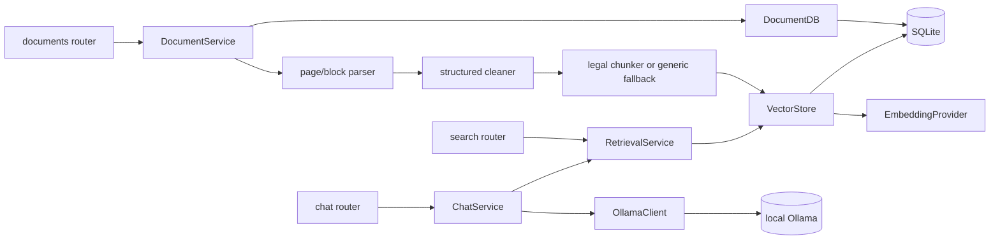

# Scatterbrain Backend Documentation

The FastAPI backend ingests PDF/TXT documents into SQLite + sqlite-vec and answers grounded questions with local Ollama inference. Legal/manual PDFs preserve pages, block geometry, hierarchy, parents, and citations; unrelated content retains the generic recursive fallback.

## Sections

| Doc | Covers |
| --- | --- |
| [legal-document-chunking.md](legal-document-chunking.md) | Legal extraction/chunking rationale, metadata, migration, retrieval, citations, operation |
| [app-and-config.md](app-and-config.md) | Lifespan wiring and validated settings |
| [models.md](models.md) | Pydantic API/internal transfer models |
| [routers.md](routers.md) | HTTP endpoints and additive compatibility |
| [services.md](services.md) | Ingestion, persistence, retrieval, and chat services |
| [evaluation.md](evaluation.md) | Isolated RAGAS evaluation |
| [tools-and-tests.md](tools-and-tests.md) | Utilities and deterministic test suites |

## Component map

## Request flows

Ingestion: `POST /documents/upload` → processing metadata/hash → page-aware parse → block clean → legal detection → clause-first parent/child or generic recursive chunks → embed children → atomically replace same-filename parents/children/vectors → `completed`/`failed`.

Query: `POST /chat/query` → wider vector child pool → deterministic identifier/amount/code/term boosts → parent/section diversification → conditional governing/continuation/cross-reference expansion → budgeted numbered source blocks → `OllamaClient.chat` → answer plus citations.

Raw retrieval: `GET /search/` uses the same hybrid `RetrievalService` without an LLM.

## Wiring convention

Services are created once in `main.py`'s lifespan and registered through each router's module-level `set_services(...)`. FastAPI `Depends` is not used for service injection.
