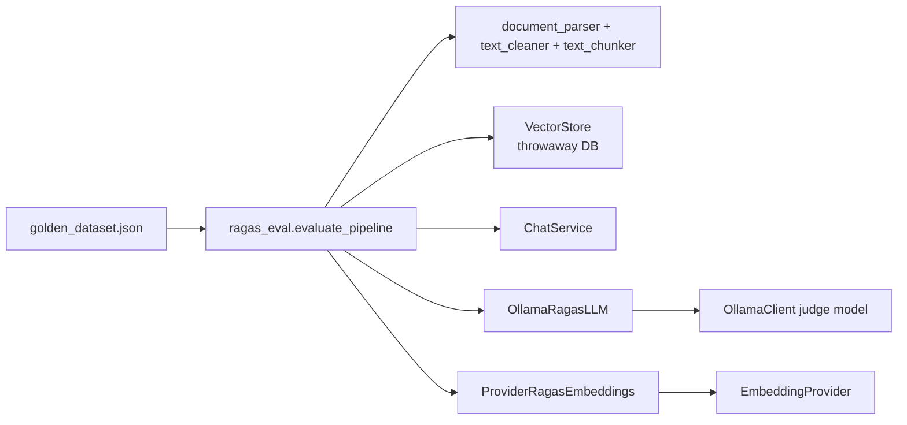

# Evaluation (`backend/evaluation/`)

Opt-in RAGAS harness that runs the real pipeline against a golden dataset and scores it with a local Ollama judge. Not used by the API at runtime. Extra dependencies: `requirements-eval.txt`.

```
python -m evaluation.ragas_eval --output ragas_report.json    # from backend/
$env:RUN_RAGAS_EVAL = "1"; pytest -m ragas -s                 # pytest gate
```

## How it maps to the app



It reuses the production parse/clean/chunk functions, `VectorStore`, `ChatService`, `OllamaClient`, and `create_embedding_provider`, but writes to a temporary DB and refuses to run against `settings.sqlite_db_path`.

## `__init__.py`

Sets `RAGAS_DO_NOT_TRACK=true` before RAGAS is imported so no telemetry leaves the machine.

## `ragas_adapters.py`

### `OllamaRagasLLM` (RAGAS `InstructorBaseRagasLLM`)

| Param | Type | Default | Notes |
| --- | --- | --- | --- |
| `ollama_client` | `OllamaClient` | required | Its `model` is the judge |
| `max_tokens` | `int` | `2048` | Per-call cap |
| `temperature` | `float` | `0.0` | Repeatable scores |
| `max_attempts` | `int` | `2` | Retries on schema validation failure |

`agenerate(prompt, response_model)` calls `OllamaClient.generate` with the model's JSON Schema as `format` (grammar-constrained decoding) and `think=False`, then validates. `generate` is a sync wrapper that refuses to run inside an active event loop.

### `ProviderRagasEmbeddings` (RAGAS `BaseRagasEmbedding`)

Param: `provider: EmbeddingProvider`. Embeds via the document path (no query prefix) so compared vectors share one space; uses batch encoding when available.

### Helpers
- `parse_structured_output(raw, response_model)` — validates JSON, tolerating a Markdown code fence. Raises `JudgeOutputError`.

## `ragas_eval.py`

### Data classes
- `GoldenSample(user_input, reference)`
- `GoldenDataset(corpus: List[Path], samples: List[GoldenSample])`
- `SampleResult(user_input, reference, response, retrieved_contexts, scores, errors)`
- `EvaluationReport(chat_model, judge_model, embedding_model, top_k, chunk_size, chunk_overlap, duration_seconds, mean_scores, samples)` with `to_dict()`

### Functions

| Function | Params | Returns |
| --- | --- | --- |
| `load_golden_dataset` | `path=DEFAULT_DATASET` | `GoldenDataset` (corpus paths resolved relative to the JSON) |
| `judge_model_name` | none | `ragas_judge_model` or `ollama_model` |
| `missing_ollama_models` (async) | `base_url`, `models` | models not pulled on the server |
| `evaluate_pipeline` (async) | `db_path`, `dataset_path=DEFAULT_DATASET`, `max_samples=None`, `embedding_provider=None` | `EvaluationReport` |
| `metric_thresholds` | none | `{metric: settings.ragas_min_*}` |
| `threshold_failures` | `report` | list of failure messages |
| `write_report` | `report`, `path` | writes indented JSON |
| `main` | `argv=None` | exit code (`1` if any threshold fails) |

Metrics: `faithfulness`, `answer_relevancy`, `context_precision`, `context_recall`. A metric that errors on one sample is recorded in `errors` and excluded from the mean.

CLI flags: `--dataset` (default golden dataset), `--output` (default `ragas_report.json`), `--max-samples` (default `settings.ragas_max_samples`).

## `datasets/`

- `golden_dataset.json` — `{"description", "corpus": [relative paths], "samples": [{"user_input", "reference"}]}`
- `corpus/harborlight_handbook.txt` — fictional handbook the golden questions are about, so answers must come from retrieval rather than model prior knowledge
